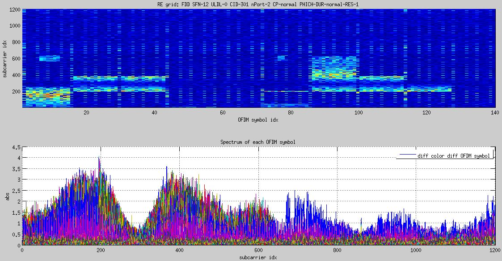

# An enhanced LTE Cell Scanner/tracker

- Support both FDD and TDD
- OpenCL accelerated
- Full Receiver algorithm for LTE 100 RB downlink (Matlab and GNU Octave scripts)
  - from IQ sample to PDSCH output and RRC SIB messages
- Support HackRF, rtlsdr, BladeRF
- USRP: Only with Matlab and GNU Octave

(It has gone too far away from the Evrytania/LTE-Cell-Scanner since the time I had less FOSS experience, so let's keep my ugly work here and not ruine the original.)

## Build
You might need to install some [libs](prepare-lib.md) before build.
```
mkdir build
cd build
cmake ../
make
```
By default above builds for rtlsdr. Following arguments could be added at the end of cmake command for different hardwares and options. 
```
-DUSE_BLADERF=1   -- build for BladeRF
-DUSE_HACKRF=1    -- build for HackRF
-DUSE_OPENCL=0    -- disable OpenCL (See notes in later chapter)
```
## Usage
- CellSearch
```
./src/CellSearch --freq-start 1890000000
```
Above tries to search LTE Cell at 1890MHz. Don't know which LTE downlink frequency is in use in your region? Check by the engineering mode of your cell phone or this [website](https://www.spectrummonitoring.com/frequencies.php).

Example output:
```
...
Detected a TDD cell! At freqeuncy 1890MHz, try 0
cell ID: 253
PSS ID: 1
RX power level: -17.0064 dB
residual frequency offset: -48.0366 Hz
            k_factor: 1
...
Detected the following cells:
Meaning -- DPX:TDD/FDD; A: #antenna ports C: CP type ; P: PHICH duration ; PR: PHICH resource type
DPX  CID  A     fc  freq-offset RXPWR  C   nRB  P   PR  CrystalCorrectionFactor
TDD  253  2  1890M         -48h   -17  N  100   N  1/2   0.99999997458380551763
```
- LTE-Tracker
```
./src/LTE-Tracker -f 1890000000
```
- LTE_DL_receiver (In Matlab or Octave)

With SDR hardware (Input frequency in MHz. For example 1815.3MHz):
```
LTE_DL_receiver(1815.3);
```
With pre-captured file:
```
LTE_DL_receiver('../regression_test_signal_file/f1815.3_s19.2_bw20_0.08s_hackrf-1.bin');
```
Please check the beginning text in LTE_DL_receiver.m to see explanation on input arguments.

See [regression_test_signal_file](regression_test_signal_file) for how to capture IQ sapmle to a .bin file via HackRF/rtlsdr/BladeRF/USRP. Lots of captured IQ files are in [LTE-Cell-Scanner-big-file](https://github.com/JiaoXianjun/LTE-Cell-Scanner-big-file).

Example output:
```
...
TDD SFN-864 ULDL-2-|D|S|U|D|D|D|S|U|D|D| CID-216 nPort-2 CP-normal PHICH-DUR-normal-RES-1
SF0 PHICH1 PDCCH1 RNTI: 
...
SF4 PHICH1 PDCCH1 RNTI: SI-RNTI SI-RNTI 
PDCCH   No.0  4CCE: Localized VRB from RB0 to RB11 MCS-7 HARQ-0 NEWind-0 RV-0 TPC-1 DAI-0
Calling asn1c decoder (../asn1_test/LTE-BCCH-DL-SCH-decode/progname) for BCCH-DL-SCH-Message.
../asn1_test/LTE-BCCH-DL-SCH-decode/progname tmp_sib_info.per -p BCCH-DL-SCH-Message
<BCCH-DL-SCH-Message>
    <message>
        <c1>
            <systemInformation>
                <criticalExtensions>
                    <systemInformation-r8>
                        <sib-TypeAndInfo>
                                <sib2>
                                    <radioResourceConfigCommon>
                                        <rach-ConfigCommon>
                                            <preambleInfo>
                                                <numberOfRA-Preambles><n52/></numberOfRA-Preambles>
...
```
## Advanced topics
For CellSearch/LTE-Tracker, "-h" can always be used to display available arguments.
### Gain setting
Use "-g X" to set gain value X to hardware. If "-g" is not used, default gain will be used.
Gain is important to get good rx performance. If CellSearch reports like "input level: avg abs(real) 0.00594959 avg abs(imag) 0.00614887", where the numbers are far below 1, larger gain value should be considered.
### carrier-sampling-clock twisted mode
"-t" disables the carrier-sampling-clock twisted mode. "-t" should be used when external mixer/converter is connected to your SDR board and their LOs are independent. Due to the independent searching over carrier frequency offset and sampling rate offset, the over all searching time is longer.
### Capture to and reload from file
Example:
```
./src/CellSearch --freq-start 1860e6 --recbin a.bin
```
Save signal in a.bin while doing cell search at frequency 1.86GHz.
```
./src/CellSearch --loadbin a.bin
```
Searche LTE cell in a.bin
### Multiple tries at a frequency
"--num-try X" performs X tries of searching at every frequencies. When signal is weak, only one try may not have you good luck.

### OpenCL
OpenCL drivers of different vendors move a lot during years. This part might be obsolete.

Install the OpenCL Driver in your system (check Intel/AMD/Nvidia website), and make sure cmake (cmake/Modules/FindOPENCL.cmake) could find them. Otherwise the OpenCL speedup won't take effect.

Before run, kernel files (src/*.cl) should be put IN THE SAME DIRECTORY AS executable program (CellSearch/LTE-Tracker) or in $PATH.
Because they need to be compiled and executed by OpenCL runtime after program launch.

OpenCL example:
```
CellSearch --loadbin test/f1890_s1.92_g0_0.16s.bin --opencl-platform=0 --opencl-device=0 --filter-workitem=32 --xcorr-workitem=2
```
OpenCL platform and device are specified by "--opencl-platform=idx1 --opencl-device=idx2" to decide which CPU/GPU is used.
When program runs, it tells you how many platforms are detected in total. Default index is 0.

Number of workitems for 6RB channel filter kernel can be specified by "--filter-workitem". Default value is 32.

Number of workitems in the 1st NDrange dimension for PSS frequency-time correlation kernel can be specified by "--xcorr-workitem" (Now it is omitted because #define FILTER_MCHN_SIMPLE_KERNEL in searcher.h). Turn the pre-define off to use "--xcorr-workitem". Default value is 2. Number of workitems of PSS correlation'2nd-NDrange-dimension depends on PPM range (use "-p" to change it).

Optimal number of workitems is platform-device dependent. Optimal values should be decided according to your computer configuration.

If you got -4(CL_MEM_OBJECT_ALLOCATION_FAILURE) or -5(CL_OUT_OF_RESOURCES) error on some OpenCL platform-device, try smaller PPM value to narrow frequency offset range. Because less range less OpenCL work-items needed.
